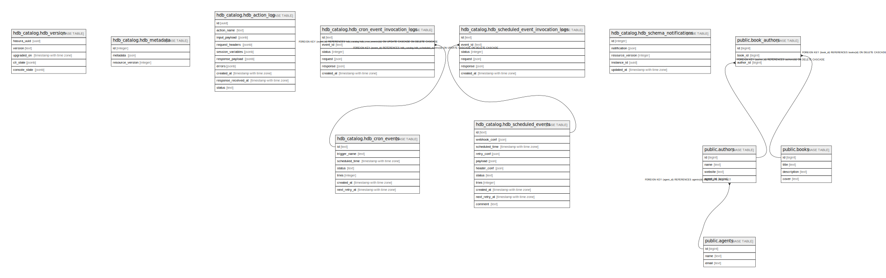

# db

## Tables

| Name | Columns | Comment | Type |
| ---- | ------- | ------- | ---- |
| [hdb_catalog.hdb_version](hdb_catalog.hdb_version.md) | 5 |  | BASE TABLE |
| [hdb_catalog.hdb_metadata](hdb_catalog.hdb_metadata.md) | 3 |  | BASE TABLE |
| [hdb_catalog.hdb_action_log](hdb_catalog.hdb_action_log.md) | 10 |  | BASE TABLE |
| [hdb_catalog.hdb_cron_events](hdb_catalog.hdb_cron_events.md) | 7 |  | BASE TABLE |
| [hdb_catalog.hdb_cron_event_invocation_logs](hdb_catalog.hdb_cron_event_invocation_logs.md) | 6 |  | BASE TABLE |
| [hdb_catalog.hdb_scheduled_events](hdb_catalog.hdb_scheduled_events.md) | 11 |  | BASE TABLE |
| [hdb_catalog.hdb_scheduled_event_invocation_logs](hdb_catalog.hdb_scheduled_event_invocation_logs.md) | 6 |  | BASE TABLE |
| [hdb_catalog.hdb_schema_notifications](hdb_catalog.hdb_schema_notifications.md) | 5 |  | BASE TABLE |
| [public.agents](public.agents.md) | 3 |  | BASE TABLE |
| [public.authors](public.authors.md) | 4 |  | BASE TABLE |
| [public.books](public.books.md) | 4 |  | BASE TABLE |
| [public.book_authors](public.book_authors.md) | 3 |  | BASE TABLE |

## Stored procedures and functions

| Name | ReturnType | Arguments | Type |
| ---- | ------- | ------- | ---- |
| hdb_catalog.gen_hasura_uuid | uuid |  | FUNCTION |

## Relations

---

> Generated by [tbls](https://github.com/k1LoW/tbls)
