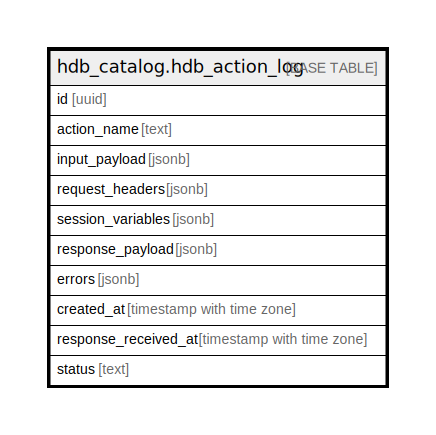

# hdb_catalog.hdb_action_log

## Description

## Columns

| Name | Type | Default | Nullable | Children | Parents | Comment |
| ---- | ---- | ------- | -------- | -------- | ------- | ------- |
| id | uuid | hdb_catalog.gen_hasura_uuid() | false |  |  |  |
| action_name | text |  | true |  |  |  |
| input_payload | jsonb |  | false |  |  |  |
| request_headers | jsonb |  | false |  |  |  |
| session_variables | jsonb |  | false |  |  |  |
| response_payload | jsonb |  | true |  |  |  |
| errors | jsonb |  | true |  |  |  |
| created_at | timestamp with time zone | now() | false |  |  |  |
| response_received_at | timestamp with time zone |  | true |  |  |  |
| status | text |  | false |  |  |  |

## Constraints

| Name | Type | Definition |
| ---- | ---- | ---------- |
| hdb_action_log_status_check | CHECK | CHECK ((status = ANY (ARRAY['created'::text, 'processing'::text, 'completed'::text, 'error'::text]))) |
| hdb_action_log_pkey | PRIMARY KEY | PRIMARY KEY (id) |

## Indexes

| Name | Definition |
| ---- | ---------- |
| hdb_action_log_pkey | CREATE UNIQUE INDEX hdb_action_log_pkey ON hdb_catalog.hdb_action_log USING btree (id) |

## Relations

---

> Generated by [tbls](https://github.com/k1LoW/tbls)
