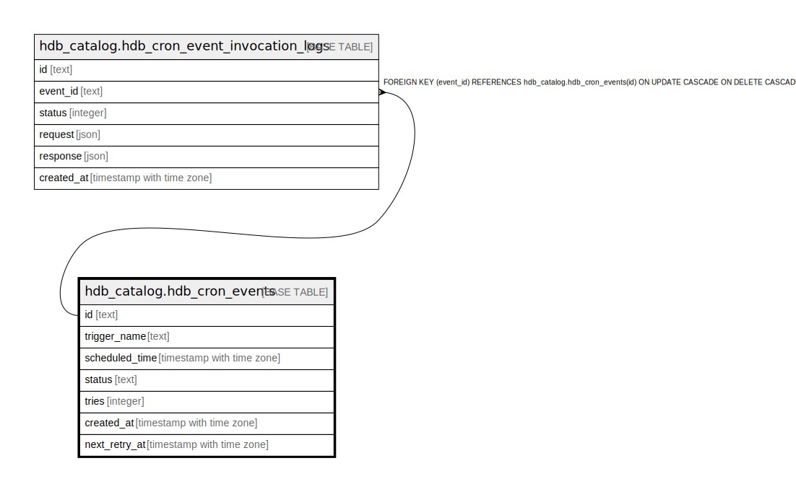

# hdb_catalog.hdb_cron_events

## Description

## Columns

| Name | Type | Default | Nullable | Children | Parents | Comment |
| ---- | ---- | ------- | -------- | -------- | ------- | ------- |
| id | text | hdb_catalog.gen_hasura_uuid() | false | [hdb_catalog.hdb_cron_event_invocation_logs](hdb_catalog.hdb_cron_event_invocation_logs.md) |  |  |
| trigger_name | text |  | false |  |  |  |
| scheduled_time | timestamp with time zone |  | false |  |  |  |
| status | text | 'scheduled'::text | false |  |  |  |
| tries | integer | 0 | false |  |  |  |
| created_at | timestamp with time zone | now() | true |  |  |  |
| next_retry_at | timestamp with time zone |  | true |  |  |  |

## Constraints

| Name | Type | Definition |
| ---- | ---- | ---------- |
| valid_status | CHECK | CHECK ((status = ANY (ARRAY['scheduled'::text, 'locked'::text, 'delivered'::text, 'error'::text, 'dead'::text]))) |
| hdb_cron_events_pkey | PRIMARY KEY | PRIMARY KEY (id) |

## Indexes

| Name | Definition |
| ---- | ---------- |
| hdb_cron_events_pkey | CREATE UNIQUE INDEX hdb_cron_events_pkey ON hdb_catalog.hdb_cron_events USING btree (id) |
| hdb_cron_event_status | CREATE INDEX hdb_cron_event_status ON hdb_catalog.hdb_cron_events USING btree (status) |
| hdb_cron_events_unique_scheduled | CREATE UNIQUE INDEX hdb_cron_events_unique_scheduled ON hdb_catalog.hdb_cron_events USING btree (trigger_name, scheduled_time) WHERE (status = 'scheduled'::text) |

## Relations

---

> Generated by [tbls](https://github.com/k1LoW/tbls)
