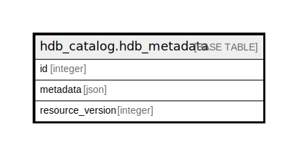

# hdb_catalog.hdb_metadata

## Description

## Columns

| Name | Type | Default | Nullable | Children | Parents | Comment |
| ---- | ---- | ------- | -------- | -------- | ------- | ------- |
| id | integer |  | false |  |  |  |
| metadata | json |  | false |  |  |  |
| resource_version | integer | 1 | false |  |  |  |

## Constraints

| Name | Type | Definition |
| ---- | ---- | ---------- |
| hdb_metadata_pkey | PRIMARY KEY | PRIMARY KEY (id) |
| hdb_metadata_resource_version_key | UNIQUE | UNIQUE (resource_version) |

## Indexes

| Name | Definition |
| ---- | ---------- |
| hdb_metadata_pkey | CREATE UNIQUE INDEX hdb_metadata_pkey ON hdb_catalog.hdb_metadata USING btree (id) |
| hdb_metadata_resource_version_key | CREATE UNIQUE INDEX hdb_metadata_resource_version_key ON hdb_catalog.hdb_metadata USING btree (resource_version) |

## Relations

---

> Generated by [tbls](https://github.com/k1LoW/tbls)
