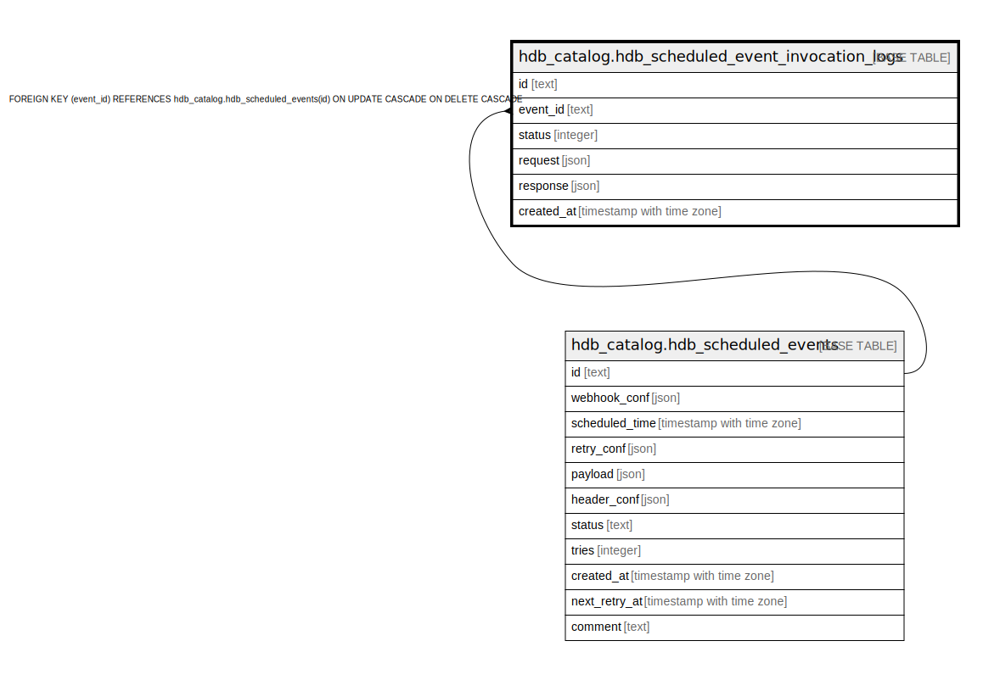

# hdb_catalog.hdb_scheduled_event_invocation_logs

## Description

## Columns

| Name | Type | Default | Nullable | Children | Parents | Comment |
| ---- | ---- | ------- | -------- | -------- | ------- | ------- |
| id | text | hdb_catalog.gen_hasura_uuid() | false |  |  |  |
| event_id | text |  | true |  | [hdb_catalog.hdb_scheduled_events](hdb_catalog.hdb_scheduled_events.md) |  |
| status | integer |  | true |  |  |  |
| request | json |  | true |  |  |  |
| response | json |  | true |  |  |  |
| created_at | timestamp with time zone | now() | true |  |  |  |

## Constraints

| Name | Type | Definition |
| ---- | ---- | ---------- |
| hdb_scheduled_event_invocation_logs_event_id_fkey | FOREIGN KEY | FOREIGN KEY (event_id) REFERENCES hdb_catalog.hdb_scheduled_events(id) ON UPDATE CASCADE ON DELETE CASCADE |
| hdb_scheduled_event_invocation_logs_pkey | PRIMARY KEY | PRIMARY KEY (id) |

## Indexes

| Name | Definition |
| ---- | ---------- |
| hdb_scheduled_event_invocation_logs_pkey | CREATE UNIQUE INDEX hdb_scheduled_event_invocation_logs_pkey ON hdb_catalog.hdb_scheduled_event_invocation_logs USING btree (id) |

## Relations

---

> Generated by [tbls](https://github.com/k1LoW/tbls)
