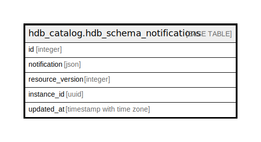

# hdb_catalog.hdb_schema_notifications

## Description

## Columns

| Name | Type | Default | Nullable | Children | Parents | Comment |
| ---- | ---- | ------- | -------- | -------- | ------- | ------- |
| id | integer |  | false |  |  |  |
| notification | json |  | false |  |  |  |
| resource_version | integer | 1 | false |  |  |  |
| instance_id | uuid |  | false |  |  |  |
| updated_at | timestamp with time zone | now() | true |  |  |  |

## Constraints

| Name | Type | Definition |
| ---- | ---- | ---------- |
| hdb_schema_notifications_id_check | CHECK | CHECK ((id = 1)) |
| hdb_schema_notifications_pkey | PRIMARY KEY | PRIMARY KEY (id) |

## Indexes

| Name | Definition |
| ---- | ---------- |
| hdb_schema_notifications_pkey | CREATE UNIQUE INDEX hdb_schema_notifications_pkey ON hdb_catalog.hdb_schema_notifications USING btree (id) |

## Relations

---

> Generated by [tbls](https://github.com/k1LoW/tbls)
