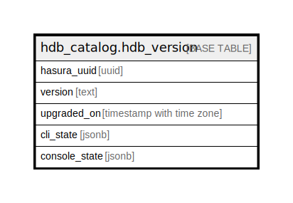

# hdb_catalog.hdb_version

## Description

## Columns

| Name | Type | Default | Nullable | Children | Parents | Comment |
| ---- | ---- | ------- | -------- | -------- | ------- | ------- |
| hasura_uuid | uuid | hdb_catalog.gen_hasura_uuid() | false |  |  |  |
| version | text |  | false |  |  |  |
| upgraded_on | timestamp with time zone |  | false |  |  |  |
| cli_state | jsonb | '{}'::jsonb | false |  |  |  |
| console_state | jsonb | '{}'::jsonb | false |  |  |  |

## Constraints

| Name | Type | Definition |
| ---- | ---- | ---------- |
| hdb_version_pkey | PRIMARY KEY | PRIMARY KEY (hasura_uuid) |

## Indexes

| Name | Definition |
| ---- | ---------- |
| hdb_version_pkey | CREATE UNIQUE INDEX hdb_version_pkey ON hdb_catalog.hdb_version USING btree (hasura_uuid) |
| hdb_version_one_row | CREATE UNIQUE INDEX hdb_version_one_row ON hdb_catalog.hdb_version USING btree (((version IS NOT NULL))) |

## Relations

---

> Generated by [tbls](https://github.com/k1LoW/tbls)
