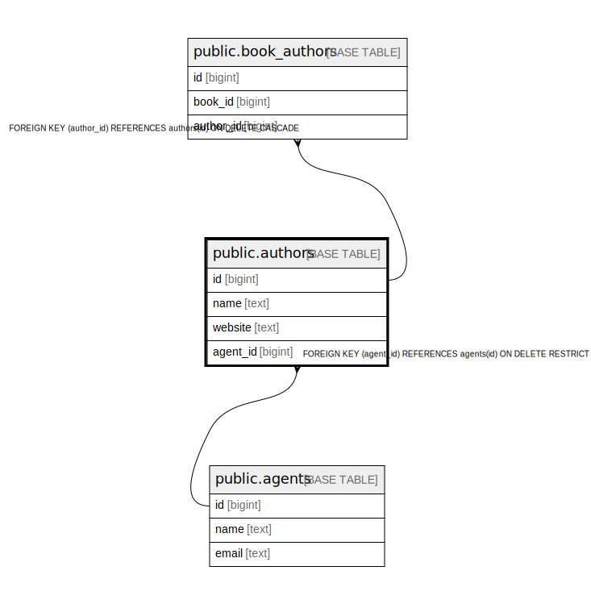

# public.authors

## Description

## Columns

| Name | Type | Default | Nullable | Children | Parents | Comment |
| ---- | ---- | ------- | -------- | -------- | ------- | ------- |
| id | bigint | nextval('authors_id_seq'::regclass) | false | [public.book_authors](public.book_authors.md) |  |  |
| name | text |  | false |  |  |  |
| website | text |  | true |  |  |  |
| agent_id | bigint |  | false |  | [public.agents](public.agents.md) |  |

## Constraints

| Name | Type | Definition |
| ---- | ---- | ---------- |
| authors_agent_id_fkey | FOREIGN KEY | FOREIGN KEY (agent_id) REFERENCES agents(id) ON DELETE RESTRICT |
| authors_pkey | PRIMARY KEY | PRIMARY KEY (id) |

## Indexes

| Name | Definition |
| ---- | ---------- |
| authors_pkey | CREATE UNIQUE INDEX authors_pkey ON public.authors USING btree (id) |

## Relations

---

> Generated by [tbls](https://github.com/k1LoW/tbls)
