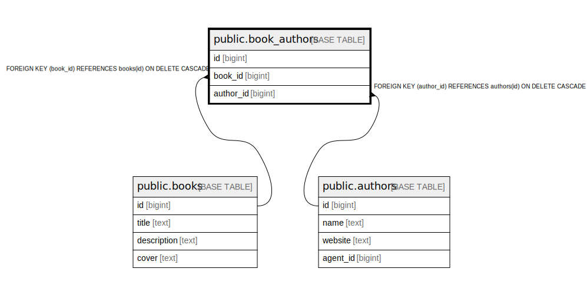

# public.book_authors

## Description

## Columns

| Name | Type | Default | Nullable | Children | Parents | Comment |
| ---- | ---- | ------- | -------- | -------- | ------- | ------- |
| id | bigint | nextval('book_authors_id_seq'::regclass) | false |  |  |  |
| book_id | bigint |  | false |  | [public.books](public.books.md) |  |
| author_id | bigint |  | false |  | [public.authors](public.authors.md) |  |

## Constraints

| Name | Type | Definition |
| ---- | ---- | ---------- |
| book_authors_author_id_fkey | FOREIGN KEY | FOREIGN KEY (author_id) REFERENCES authors(id) ON DELETE CASCADE |
| book_authors_book_id_fkey | FOREIGN KEY | FOREIGN KEY (book_id) REFERENCES books(id) ON DELETE CASCADE |
| book_authors_pkey | PRIMARY KEY | PRIMARY KEY (id) |
| book_authors_book_id_author_id_key | UNIQUE | UNIQUE (book_id, author_id) |

## Indexes

| Name | Definition |
| ---- | ---------- |
| book_authors_pkey | CREATE UNIQUE INDEX book_authors_pkey ON public.book_authors USING btree (id) |
| book_authors_book_id_author_id_key | CREATE UNIQUE INDEX book_authors_book_id_author_id_key ON public.book_authors USING btree (book_id, author_id) |

## Relations

---

> Generated by [tbls](https://github.com/k1LoW/tbls)
