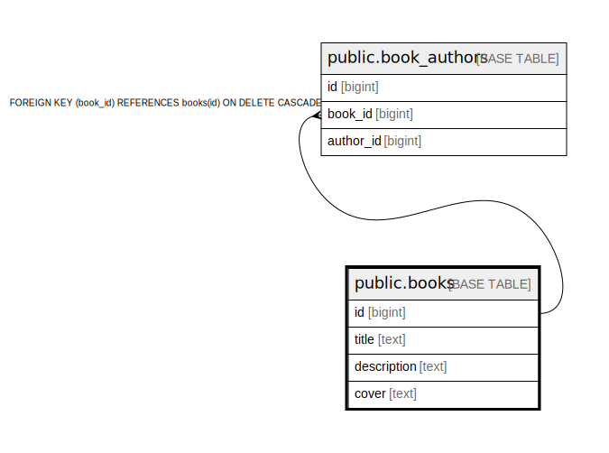

# public.books

## Description

## Columns

| Name | Type | Default | Nullable | Children | Parents | Comment |
| ---- | ---- | ------- | -------- | -------- | ------- | ------- |
| id | bigint | nextval('books_id_seq'::regclass) | false | [public.book_authors](public.book_authors.md) |  |  |
| title | text |  | false |  |  |  |
| description | text |  | false |  |  |  |
| cover | text |  | false |  |  |  |

## Constraints

| Name | Type | Definition |
| ---- | ---- | ---------- |
| books_pkey | PRIMARY KEY | PRIMARY KEY (id) |

## Indexes

| Name | Definition |
| ---- | ---------- |
| books_pkey | CREATE UNIQUE INDEX books_pkey ON public.books USING btree (id) |

## Relations

---

> Generated by [tbls](https://github.com/k1LoW/tbls)
